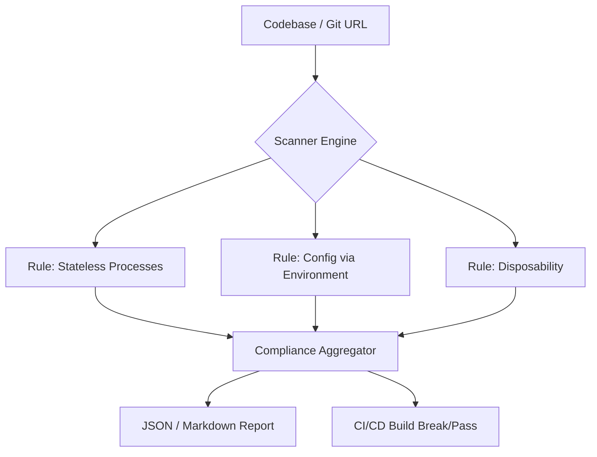

<div align="center">


<h1>12-Factor App Scanner</h1>

<p><strong>Automated Cloud-Native Compliance &middot; Enterprise SaaS Governance</strong></p>

[](LICENSE)
[](/terraform)
[](/src)

<br/>

> **Is your application truly cloud-native?** The 12-Factor App Scanner provides automated static analysis to verify compliance with the 12-factor methodology, ensuring scalability, disposability, and dev/prod parity.

</div>

---

## 🏗️ High-Level Architecture

The scanner operates as a **Compliance-as-Code** engine that injects into the "Shift-Left" security and governance phase.



### Key Components
- **Identity & Context Engine**: Analyzes project metadata to determine technology stack (Node, Go, Python, .NET).
- **Factor Checkers**: 12 modular plugins, each dedicated to a specific factor.
- **Remediation Database**: Mapping of failures to Devopstrio Landing Zone accelerators to fix issues immediately.

---

## 🚀 12-Factor Coverage

| Factor | Analysis Strategy | Implementation |
|:---|:---|:---|
| **I. Codebase** | Git repository verification and multi-deployment tracking. | Core Engine |
| **II. Dependencies** | Manifest scanning (npm, pip, nuget) for strict isolation. | Dependency Plugin |
| **III. Config** | Environment variable detection & secret-leak prevention. | Config Plugin |
| **IV. Backing Services** | Resource mapping and stateless connection evaluation. | Resource Plugin |
| **V. Build, Release, Run** | Pipeline stage separation and artifact immutability. | CI/CD Plugin |
| **XI. Logs** | Verification of standard output streaming vs file-writing. | Observability Plugin |

---

## 🛠️ Getting Started

### Prerequisites
- Python 3.11+
- Terraform (for cloud deployment)

### CLI Usage
```bash
# Install the scanner
pip install devopstrio-12factor-scanner

# Scan a local project
12factor-scan ./services/my-app --report-format=html
```

---

## ☁️ Infrastructure-as-Code

The scanner is designed to run as a serverless endpoint. The `/terraform` directory provides:
- **Azure**: Function App with Key Vault and App Insights.
- **AWS**: Lambda with API Gateway and CloudWatch.

---
<sub>&copy; 2026 Devopstrio &mdash; Enterprise Cloud &middot; AI &middot; DevOps Acceleration Partner</sub>
