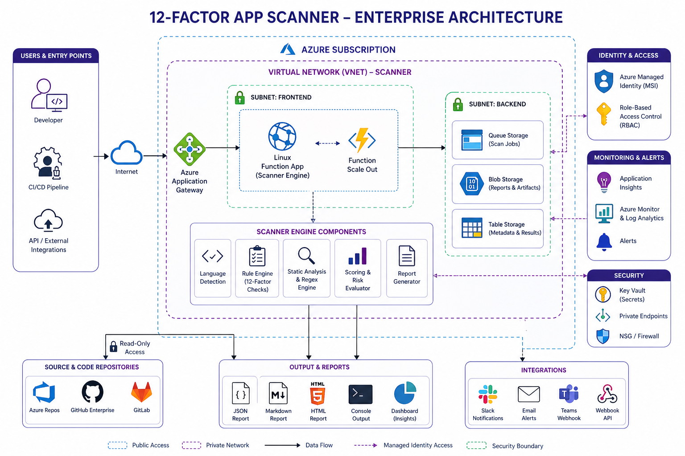



<h1>12-Factor App Scanner</h1>

<strong>Expert Enterprise Architecture &middot; Multi-Cloud Governance</strong>

 

> **Precision Governance for the Modern Enterprise.** The 12-Factor App Scanner is a production-grade static analysis engine designed to enforce cloud-native benchmarks across Azure, AWS, and GCP environments.

---

## 🏛️ Enterprise Architecture

Our architecture is designed for **Zero-Trust Security** and **Elastic Scalability**. The engine resides within a hardened Virtual Network (VNet), ensuring your source code and compliance metadata remain within your private cloud boundary.

### 🧩 Engine Components
- **Language Detection**: Automatic technology stack identification.
- **Rule Engine**: 12-factor benchmark enforcement.
- **Static Analysis**: High-fidelity regex and pattern matching.
- **Risk Evaluator**: Weighted scoring based on enterprise risk profiles.
- **Report Generator**: Multi-format output (JSON, Markdown, HTML).

### 🛡️ Security & Identity
- **Private Link**: All backend storage and secret vaults are connected via Private Endpoints.
- **Managed Identity (MSI)**: Password-less authentication for Git repositories and Azure Services.
- **VNet Isolation**: Strict Network Security Group (NSG) rules between Frontend and Backend subnets.

---

## 🚀 Deployment & Integration

The scanner is built to integrate with major enterprise source control and notification systems:
- **Repositories**: GitHub Enterprise, Azure Repos, GitLab.
- **Notifications**: Slack, Microsoft Teams, Email, Custom Webhooks.

---
&copy; 2026 Devopstrio &mdash; Enterprise Cloud &middot; AI &middot; DevOps Acceleration Partner
