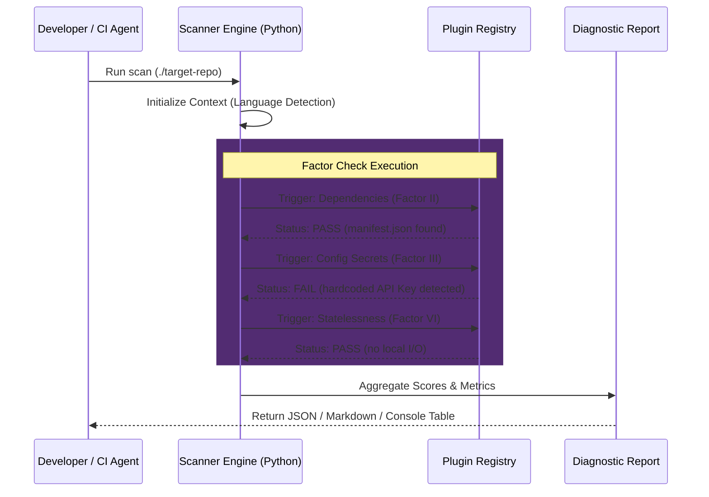
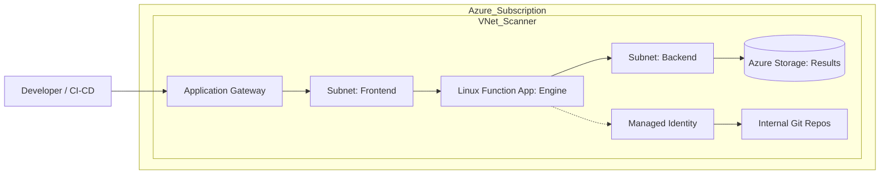

<div align="center">


<h1>12-Factor App Scanner</h1>

<p><strong>Enterprise Cloud Governance &middot; Automated Compliance Audit &middot; Shift-Left Architecture</strong></p>

[](https://devopstrio.co.uk/)
  <a href="https://github.com/orgs/devopstrio/repositories"></a>
[](/terraform)
[](Dockerfile)

<br/>

> **Scalability is not an accident; it is an architectural requirement.** The Devopstrio 12-Factor Scanner ensures your application codebases are built for high-performance cloud environments through automated, multi-factor static analysis.

</div>

---

## 🏛️ High-Level Architecture

The 12-Factor Scanner is built as a **Headless Compliance Engine**. It can be executed as a local CLI, a containerized CI/CD step, or a scalable serverless API.

### 🔄 Scanner Execution Lifecycle (Workflow)



---

## ☁️ Enterprise Deployment Topology

When deployed via the included **Terraform blueprints**, the scanner resides within a hardened network perimeter, ensuring that your organization's intellectual property (source code) never leaves your private cloud boundary.



### Key Architectural Pillars
- **Zero-Trust Identity**: Uses Azure Managed Identity (MSI) to authenticate against internal repositories without requiring stored passwords.
- **Network Isolation**: The engine runs within a delegated VNet subnet, preventing data exfiltration to the public web.
- **Elastic Scale**: Built on the Azure Elastic Premium plan, providing instant scaling for high-concurrency enterprise auditing.

---

## 📋 Comprehensive 12-Factor Audit Log

| Factor | Governance Logic | Tooling |
|:---|:---|:---|
| **I. Codebase** | Verifies Git tracking and single-codebase-to-multi-deployment patterns. | `git-python` |
| **II. Dependencies** | Scans for manifest files (npm, pip, maven) to ensure zero implicit dependencies. | `parser-engine` |
| **III. Config** | High-fidelity regex scanning for hardcoded secrets and environment variables. | `regex-security` |
| **IV. Backing Services** | Evaluates resource strings to confirm database/cache connectivity is secondary. | `static-analysis` |
| **VI. Processes** | Detects local file writing and long-lived stateful memory patterns. | `io-analyzer` |
| **XI. Logs** | Audits print/console/logging statements for event-stream compliance. | `observability-check` |

---

## 🚀 DevOps Integration Workflow

Integrate the scanner into your existing Devopstrio Landing Zone using our pre-built GitHub Action:

```yaml
jobs:
  governance:
    steps:
      - uses: actions/checkout@v3
      - name: 12-Factor Audit
        uses: devopstrio/12-factor-scanner-action@v2
        with:
          threshold: 85
          report-type: 'markdown'
```

---
<sub>&copy; 2026 Devopstrio &mdash; Enterprise Cloud &middot; AI &middot; DevOps Acceleration Partner</sub>
