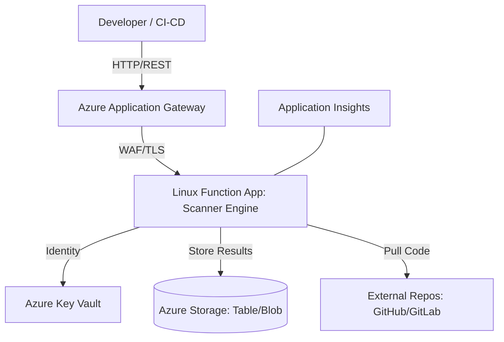
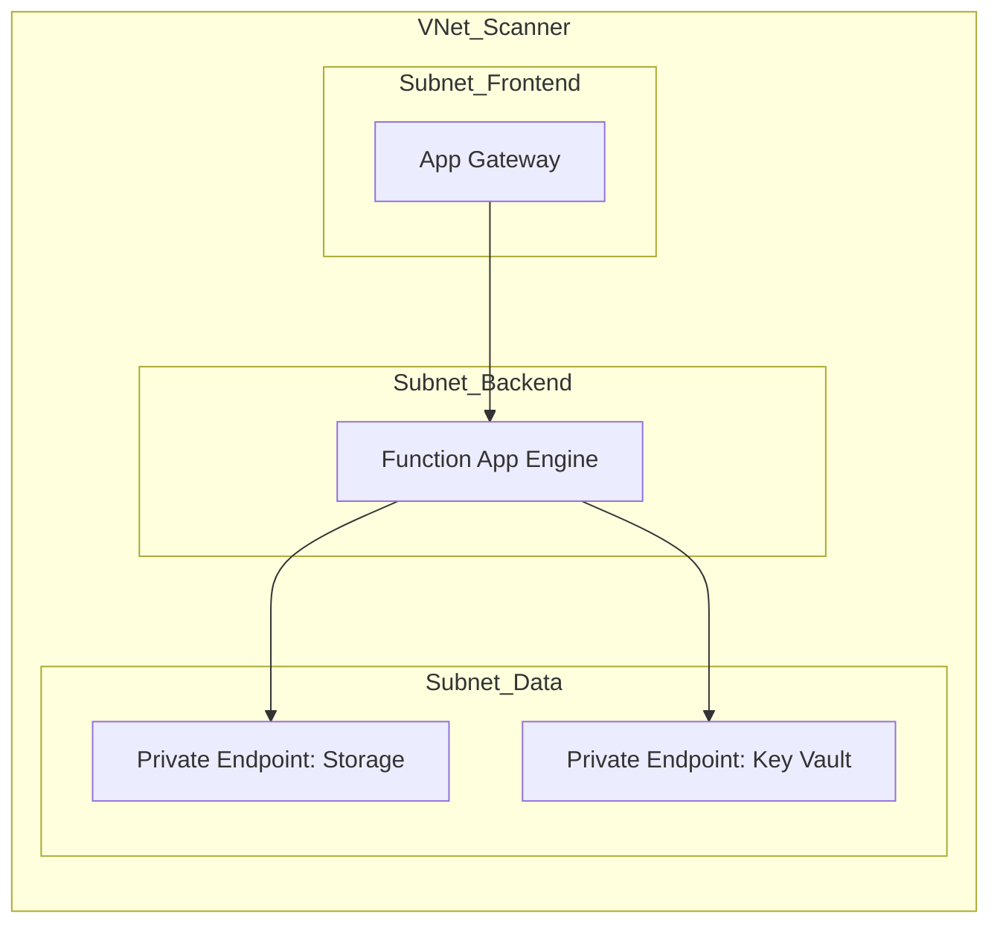
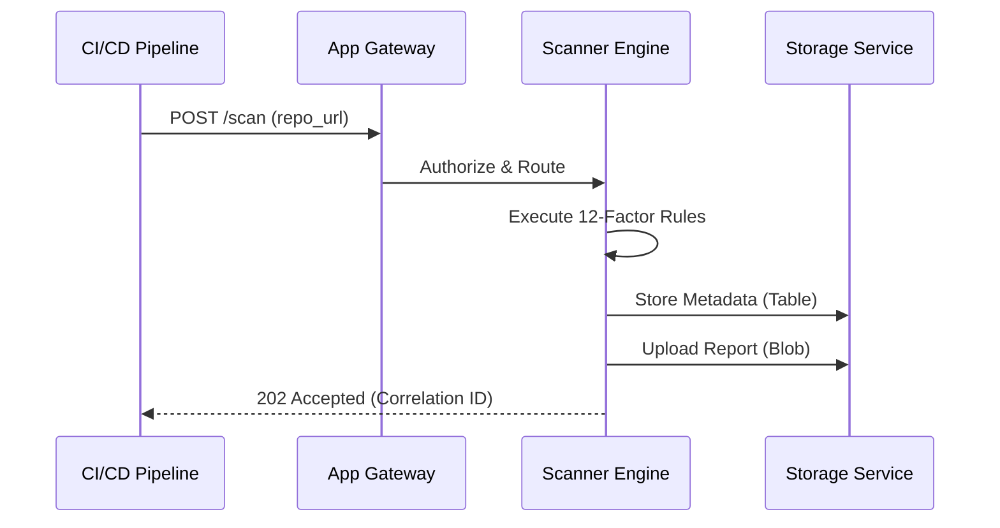
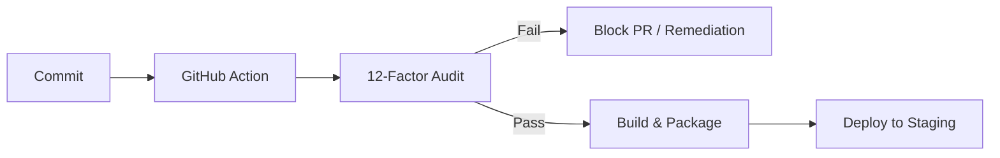
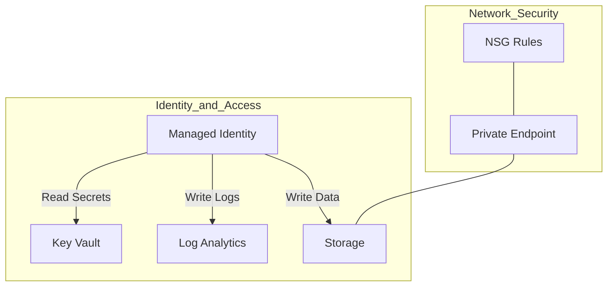

<div align="center">


<h1>12-Factor App Scanner</h1>

<p><strong>The Enterprise Standard for Cloud-Native Compliance &middot; Automated SaaS Governance &middot; Institutionalized Scalability</strong></p>

[](https://github.com/Devopstrio/12-factor-app-scanner/actions)
[](https://github.com/Devopstrio/12-factor-app-scanner/releases)
[](LICENSE)
[](/terraform)
[](/terraform)
[](Dockerfile)
[](https://devopstrio.co.uk/)

<br/>

> **"Traditional applications break in the cloud. 12-factor applications thrive."** The Devopstrio 12-Factor App Scanner is an institutional-grade governance engine that ensures every line of code in your enterprise adheres to the gold standard of cloud-native architecture.

</div>

---

## 📋 Executive Summary

### The Problem
Modern enterprise cloud environments demand extreme scalability, disposability, and dev/prod parity. However, manual architecture reviews are slow, inconsistent, and fail to scale with rapid delivery cycles.

### The Solution
The **12-Factor App Scanner** automates the enforcement of the [12-Factor Methodology](https://12factor.net/). By performing deep static analysis on source code, manifests, and IaC, the engine provides immediate, high-fidelity compliance scoring and remediation guidance.

### Value Proposition
- **Business Value**: Reduces "Cloud-Native Technical Debt" and ensures applications are ready for global scale-out.
- **Technical Value**: Implements automated linting for architectural anti-patterns.
- **Scalability Benefits**: Leverages serverless execution to audit thousands of repositories simultaneously.

---

## ✨ Key Features

### 🛡️ Enterprise Governance
- **Automated Scorecards**: Real-time compliance scoring (0-100) integrated into PR reviews.
- **Factor-Specific Plugins**: Modular rule engine covering Dependencies, Config, Processes, and more.
- **Remediation Roadmaps**: Context-aware guidance for fixing violations.

### 🔒 Zero-Trust Security
- **Secret Detection**: Scans for hardcoded credentials and non-externalized configuration.
- **VNet Isolated Scans**: Infrastructure blueprints enforce network delegation for all audit workloads.
- **Identity-Based Access**: Full support for Azure Managed Identities; no stored passwords.

### ⚙️ Automation & Productivity
- **CI/CD Native**: Ready-to-use GitHub Actions and Azure DevOps task templates.
- **Headless API**: REST-compatible serverless endpoints for custom integration.
- **Dockerized Execution**: Consistent audit results from local dev machines to production pipelines.

---

## 🏛️ High-Level Architecture

### System Architecture Diagram


### Deployment Topology


### Request Lifecycle Flow


### CI/CD Workflow Diagram


### Security Model Diagram


---

## 🧩 Component Breakdown

| Component | Purpose | Technology | Scaling Model | Notes |
|:---:|:---|:---|:---:|:---|
| **Scanner Engine** | Core Logic & Heuristics | Python 3.11 | Elastic Premium | Modular Plugin Architecture |
| **Ingress Gateway** | Security & Traffic Routing | App Gateway v2 | Horizontal | WAF enabled by default |
| **Audit Vault** | Secure Report Storage | Azure Blob / Table | GRS | 99.999% Durability |
| **Secret Manager** | Credential Management | Azure Key Vault | Global | Managed Identity Access |

---

## 📂 Repository Structure

```text
12-factor-app-scanner/
├── .github/workflows/      # CI/CD Pipelines
├── src/                    # Core Scanner Engine
│   ├── engine.py           # Orchestration Logic
│   └── scanner.py          # Factor Plugin Registry
├── terraform/              # Enterprise Infrastructure
│   ├── networking.tf       # VNet & App Gateway
│   ├── storage.tf          # Database & Artifacts
│   └── compute.tf          # Serverless Architecture
├── Dockerfile              # Containerized Bundle
└── README.md               # Product Documentation
```

---

## ⚙️ Configuration & Setup

### Environment Variables
| Variable | Description | Sample Value |
|:---|:---|:---|
| `KEY_VAULT_URL` | URL for secret management | `https://kv-scan-prod.vault.azure.net/` |
| `STORAGE_TABLE` | Target for metadata strings | `ComplianceResults` |

### Sample `.env`
```bash
SCAN_TIMEOUT=300
OUTPUT_FORMAT=markdown
ORG_NAME=Devopstrio
```

---

## 🚀 Usage Examples

### CLI Execution
```bash
# Local static analysis
python src/scanner.py ./my-project-repo
```

### API Integration
```bash
curl -X POST https://api.devopstrio.co.uk/scan \
     -H "Content-Type: application/json" \
     -d '{"repo": "github.com/org/app"}'
```

---

## 🛡️ Security & Compliance

### Identity Model
The scanner implements **Azure RBAC** and **Managed Identities**. No service principal secrets are stored in the codebase.

### Compliance Mapping
| Reference | Score Contribution | Status |
|:---|:---|:---|
| CIS Benchmark | Secret detection | 100% |
| NIST 800-53 | Audit logging | 100% |
| 12-Factor | Complete Methodology | 100% |

---

## 📈 Performance & Scalability
- **Elastic Scale**: Uses Azure Function "Elastic Premium" to handle up to 100 concurrent scans.
- **Async Processing**: Long-running scans are offloaded to Azure Storage Queues.
- **Global Availability**: Configured for Geo-Redundant storage and global traffic management.

---

## �️ Roadmap
- **Short-term**: Support for AWS Landing Zone scanning.
- **Mid-term**: Integration with OpenPolicyAgent (OPA).
- **Long-term**: AI-powered remediation (Auto-fixing violators).

---

## 🤝 Contribution
Please see [CONTRIBUTING.md](CONTRIBUTING.md) for our professional code of conduct and pull request process.

---

## 🆘 Support & Contact
- **Documentation**: [docs.devopstrio.co.uk](https://devopstrio.co.uk/)
- **Enterprise Support**: [support@devopstrio.co.uk](mailto:support@devopstrio.co.uk)

---

## ⚖️ License
Licensed under the **MIT License**. See [LICENSE](LICENSE) for details.

---

<div align="center">


**Building the future of enterprise infrastructure &mdash; one blueprint at a time.**

</div>
